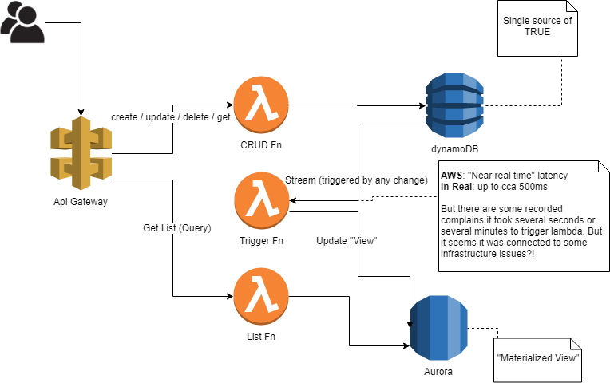

# aws-rdsdynamo

SAM application for usecase where you need schema flexibility of DynamoDB and SQL queries flexibility for getting the list of items.

It materialize required fields from DynamoDB to Aurora Serverless, so "the CRUD function" works on top of Dynamo DB and "the list function" works on top of aurora serverless.

It utilizes new data API feature of Aurora Serverless, so that's why there is some updated version of rdsdataservices in node_modules until it's generally available in lambda environment.



## Requirements

-   AWS CLI already configured with Administrator permission
-   [NodeJS 8.10+ installed](https://nodejs.org/en/download/)
    develop sam locally
-   See [Serverless Application Model (SAM) HOWTO Guide](https://docs.aws.amazon.com/serverless-application-model/latest/developerguide/serverless-quick-start.html) for more details in how to get started.
-   [Docker installed](https://www.docker.com/community-edition) - required to

##Deploy

##### 1) cfn-modules

At first, we use `cfn-modules` to simplify deployment. It's specified in `package.json` so to install it just simply run:

```powershell
npm instll
```

##### 2) bare deployment

Then we can create infrastructure. Take a look into `deploy.ps1` and update variables according your needs.

```powershell
Powershell.exe -ExecutionPolicy Unrestricted -File .\deploy.ps1

```

##### 3) enable data API

Then go to the console and enable data API on RDS -> for now it's not possible in CloudFormation.

##### 4) create tables in RDS

Then run the initialization. (It requires RDS data API enabled in previous step.) Take a look into `init.ps1` and update variables according your needs.

```powershell
Powershell.exe -ExecutionPolicy Unrestricted -File .\init.ps1

```
